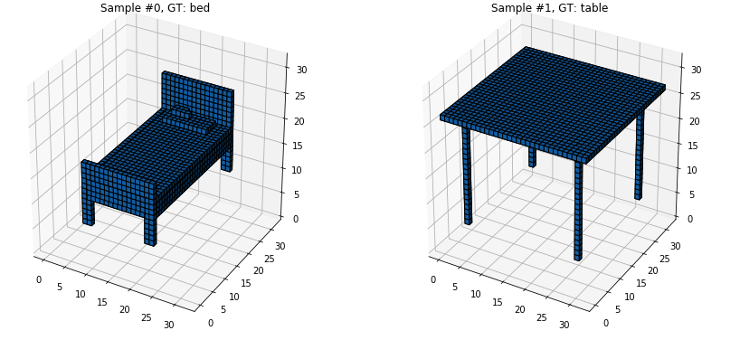
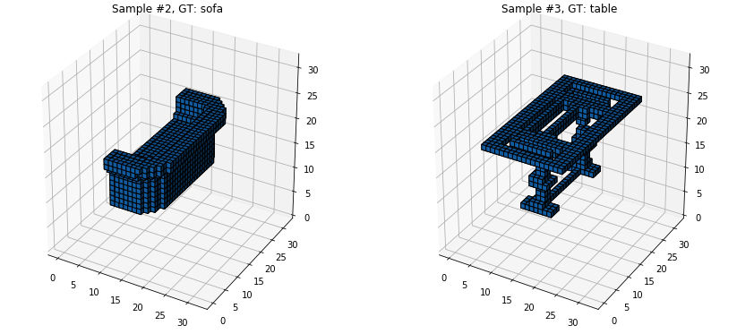

# Neural Network for 3D object classification
#### Original Paper: http://cs231n.stanford.edu/reports/2016/pdfs/417_Report.pdf
#### Abstract:
          
3D object classification is an interesting topic especially
when large scale 3D CAD datasets are available. A convo-
lutional neural network combining spatial transformation
network is used to classify 3D objects in a subset of Mod-
elNet. The spatial transformation network is an attempt to
deal with rotation invariance problem in 3D object classifi-
cation. We evaluate our method by comparing with previous
result.

#### Voxel representations:

#### Dataset preparation
- Download the dataset from https://modelnet.cs.princeton.edu/
- Download the binvox exe file from https://www.patrickmin.com/binvox/
- run the command in the terminal. Dataset root dir is ModelNet10 or ModelNet40

for f in [dataset root dir]/*/*/*.off; do ./binvox -d 32 -pb -cb $f; done
- Doing this, .binvox files will be generated in the same folder locations.
- Now, run binvox_to_numpy.py or binvox_to_numpy_40.py according for modelnet10 or modelnet40 respectively (binvox_rw.py should be in the same root directory).
- .npz file will be generated which when extracted contains four files for X_train, X_test,y_train and y_test

#### Training the network
Prerequisite:
Pytorch should be configured with cuda
- Run the respective files individually after setting the dataset path in it

